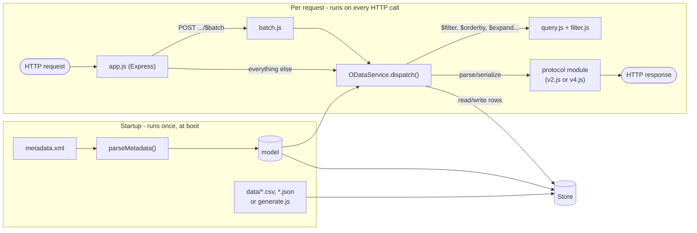

# odata-server

Generic, metadata-driven OData server that serves one model as V2 and V4 at the same time.

## Getting started

```sh
yarn install
yarn start
```

From the repo root you can also use `make start-odata` / `make dev-odata`.

Everything is configured through environment variables, all optional:

| Variable       | Default                    | Purpose                                     |
| -------------- | -------------------------- | ------------------------------------------- |
| `PORT`         | `3000`                     | HTTP port                                   |
| `MODEL_DIR`    | `../models/PurchaseOrderSrv` (`/models` in the image) | Path to the model to serve, or to a folder holding exactly one model |
| `SERVICE_NAME` | basename of `MODEL_DIR`    | Used to build the default service paths     |
| `V2_PATH`      | `/odata/v2/<SERVICE_NAME>` | V2 service root - set to `""` to disable V2 |
| `V4_PATH`      | `/odata/v4/<SERVICE_NAME>` | V4 service root - set to `""` to disable V4 |
| `MOCK_ROWS`    | `20`                       | Rows generated for each entity set without a seed file - `0` leaves it empty |

A model directory needs a `metadata.xml` (either V2 or V4 CSDL - whichever protocol didn't write it gets its metadata generated from the other) and a `data/` folder with one CSV or JSON file per entity set, named after the entity set, its entity type, or `<namespace>-<EntityType>` (first match wins). See [models/PurchaseOrderSrv](../models/PurchaseOrderSrv/) for a working example.

An entity set without a seed file gets `MOCK_ROWS` generated rows ([lib/generate.js](lib/generate.js)). They are deterministic (seeded from the entity set's name), fit each property's type and facets, take plausible values from property names, and hold real keys in their foreign keys, so navigation works; when a foreign key is part of the key (an order's items), the rest of the key counts up per parent. `node mock-data.js <modelDir> [rows]` (`make mock-data` from the repo root) writes them to the model's `data/` folder as seed files to edit, and never overwrites an existing one. A seed file with only a header row keeps its entity set empty.

The image contains no model. Mount one as `/models/<ServiceName>`, and the server finds it; the folder name is the service name. For example, from the repo root:

```sh
docker run -p 3000:3000 -v "$PWD/models/PurchaseOrderSrv:/models/PurchaseOrderSrv:ro" odata-server:1.0.0
```

To mount several models, set `MODEL_DIR` to the one to serve, e.g. `-v "$PWD/models:/models:ro" -e MODEL_DIR=/models/Northwind`.

## Supported types

All primitive Edm types, plus:

- **Complex types**, nested and in collections. In V2 a complex value carries its type in `__metadata`, as SAP Gateway sends it.
- **Enum types** (V4). V2 has no enums, so there they are `Edm.String` holding the member name.
- **Collection-valued properties** (V4). V2 has none, so they are left out of the V2 service, with a `not in V2: ...` line in the startup log.
- **Inheritance** (`BaseType`). Each derived type gets its base's key, properties and navigations, so the generated `$metadata` needs no `BaseType`.

In a CSV seed file, a complex or collection value goes in its cell as JSON. Filtering or sorting on a field inside a complex value is not supported.

The tests load Northwind (V2 and V4) and TripPin unmodified, see [test/fixtures/real](test/fixtures/real/).

## Supported query options

`$filter`, `$orderby`, `$top`, `$skip`, `$select`, `$expand` (including nested V4 options like `$expand=Items($select=Material;$top=2)`), `$count`/`$inlinecount`, `$search`, and `$batch` (with atomic changesets) all work, on both protocols.

Not supported - rejected with `501 Not Implemented`: `$apply`, `$compute`, `$skiptoken`, `$deltatoken`, and any `$format` other than JSON.

A navigation the server cannot join (for example a many-to-many link without a `ReferentialConstraint`) doesn't stop the service from starting. It is disabled with a `navigation disabled: ...` line in the startup log, and requests that use it get a `501` saying why.

## Actions and functions

V4 actions and functions, bound (`People('x')/NS.ShareTrip`) and imported (`GetNearestAirport(lat=1,lon=2)`), and V2 function imports (`ApprovePurchaseOrder?PurchaseOrderId='1'`) can be called, also inside `$batch`. A mock doesn't know what an operation does, so the server:

- checks the method: `POST` for actions, `GET` for functions, `m:HttpMethod` for V2 function imports (`405` otherwise)
- reads the parameters from the JSON body (V4 actions), the path (V4 functions) or the query string (V2), and logs the call with them: `action ShareTrip on /odata/v4/TripPin/People('x') {"userName":"bob","tripId":1}`
- answers with what the return type allows, and changes no data:

| Return type | Response |
| --- | --- |
| None | `204` |
| The entity type it was called on | That entity, unchanged: an Approve on an order returns the order |
| An entity type whose key the parameters carry | That entity (`404` if there is none), as for SAP Gateway's function imports for one entity |
| Any other entity type, or a collection of one | Rows of that type's entity set, with the query options applied |
| A primitive or complex type, or a collection of one | A neutral value: `""`, `0`, `false`, an object of those, `[]` |

Operations are served on the protocol the metadata was written for; the other protocol's `$metadata` leaves them out, with a `not in V2: ...` or `not in V4: ...` line in the startup log. Parameter aliases (`@p`) and path segments after an operation are rejected with `501`. [models/TripPin](../models/TripPin/) is an example with both kinds of V4 operations.

## Architecture



One model, parsed once at startup, backs a V2 service and a V4 service sharing the same in-memory `Store`. Each protocol module only knows how its own wire format looks (literals, JSON envelope, query option names); `service.js` does the actual URL/key parsing, navigation, and CRUD, protocol-agnostically.

> [!IMPORTANT]
> Run a single replica. Each instance keeps its own in-memory copy of the data, so with more than one replica, writes land on one pod and reads may come from another. Restarting the server resets the data to the seed files.

## Possible future improvements

- **Operation effects** - actions and functions answer without changing data; a per-model rule (e.g. Approve sets `Status` to `Approved`) would make them act.
- **Operations on both protocols** - translating V2 function imports to V4 actions and functions and back, so the generated `$metadata` has them too.
- **Persistent storage** - swap the in-memory `Store` for a real database.
- **Broader query option support** - `$apply`, `$compute`, and server-driven paging via `$skiptoken`/`$deltatoken` are currently rejected with 501.
- **Draft handling** - no draft support, which most Fiori Elements V4 apps with edit flows depend on.
- **Optimistic concurrency** - no ETags and no `If-Match` checks, so concurrent updates are last-write-wins.

## References

Specs and docs used for implementing the metadata parser, $filter, $expand, and $batch:

- [OData Version 2.0](https://www.odata.org/documentation/odata-version-2-0/) - odata.org docs (metadata, URI conventions, JSON format)
- [OData Version 4.01, Part 1: Protocol](https://docs.oasis-open.org/odata/odata/v4.01/odata-v4.01-part1-protocol.html) - OASIS standard
- [OData CSDL XML Representation, Version 4.01](https://docs.oasis-open.org/odata/odata-csdl-xml/v4.01/os/odata-csdl-xml-v4.01-os.html) - the $metadata XML format for V4
- [SAP Annotations for OData Version 2.0](https://sap.github.io/odata-vocabularies/docs/v2-annotations.html) - `sap:` namespace attributes (label, display-format, content-version, etc.)
