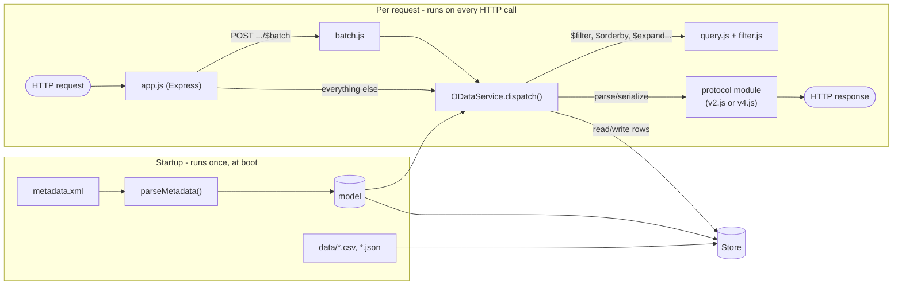

# odata-server

Generic, metadata-driven OData server that serves one model as V2 and V4 at the same time.

## Getting started

```sh
yarn install
yarn start
```

From the repo root you can also use `make start-odata` / `make dev-odata`.

Everything is configured through environment variables, all optional:

| Variable       | Default                    | Purpose                                     |
| -------------- | -------------------------- | ------------------------------------------- |
| `PORT`         | `3000`                     | HTTP port                                   |
| `MODEL_DIR`    | `../models/PurchaseOrderSrv` (`/models/PurchaseOrderSrv` in the image) | Path to the model to serve, or to a folder holding exactly one model |
| `SERVICE_NAME` | basename of `MODEL_DIR`    | Used to build the default service paths     |
| `V2_PATH`      | `/odata/v2/<SERVICE_NAME>` | V2 service root - set to `""` to disable V2 |
| `V4_PATH`      | `/odata/v4/<SERVICE_NAME>` | V4 service root - set to `""` to disable V4 |

A model directory needs a `metadata.xml` (either V2 or V4 CSDL - whichever protocol didn't write it gets its metadata generated from the other) and a `data/` folder with one CSV or JSON file per entity set, named after the entity set, its entity type, or `<namespace>-<EntityType>` (first match wins). See [models/PurchaseOrderSrv](../models/PurchaseOrderSrv/) for a working example.

The image contains no model. Mount one under `/models`, for example `docker run -p 3000:3000 -v "$PWD/models:/models:ro" po-odata-server:1.0.0` from the repo root.

## Supported query options

`$filter`, `$orderby`, `$top`, `$skip`, `$select`, `$expand` (including nested V4 options like `$expand=Items($select=Material;$top=2)`), `$count`/`$inlinecount`, `$search`, and `$batch` (with atomic changesets) all work, on both protocols.

Not supported - rejected with `501 Not Implemented`: `$apply`, `$compute`, `$skiptoken`, `$deltatoken`, and any `$format` other than JSON.

A navigation the server cannot join (for example a many-to-many link without a `ReferentialConstraint`) doesn't stop the service from starting. It is disabled with a `navigation disabled: ...` line in the startup log, and requests that use it get a `501` saying why.

## Architecture



One model, parsed once at startup, backs a V2 service and a V4 service sharing the same in-memory `Store`. Each protocol module only knows how its own wire format looks (literals, JSON envelope, query option names); `service.js` does the actual URL/key parsing, navigation, and CRUD, protocol-agnostically.

> [!IMPORTANT]
> Run a single replica. Each instance keeps its own in-memory copy of the data, so with more than one replica, writes land on one pod and reads may come from another. Restarting the server resets the data to the seed files.

## Possible future improvements

- **Persistent storage** - swap the in-memory `Store` for a real database.
- **Broader query option support** - `$apply`, `$compute`, and server-driven paging via `$skiptoken`/`$deltatoken` are currently rejected with 501.
- **Draft handling** - no draft support, which most Fiori Elements V4 apps with edit flows depend on.
- **Optimistic concurrency** - no ETags and no `If-Match` checks, so concurrent updates are last-write-wins.

## References

Specs and docs used for implementing the metadata parser, $filter, $expand, and $batch:

- [OData Version 2.0](https://www.odata.org/documentation/odata-version-2-0/) - odata.org docs (metadata, URI conventions, JSON format)
- [OData Version 4.01, Part 1: Protocol](https://docs.oasis-open.org/odata/odata/v4.01/odata-v4.01-part1-protocol.html) - OASIS standard
- [OData CSDL XML Representation, Version 4.01](https://docs.oasis-open.org/odata/odata-csdl-xml/v4.01/os/odata-csdl-xml-v4.01-os.html) - the $metadata XML format for V4
- [SAP Annotations for OData Version 2.0](https://sap.github.io/odata-vocabularies/docs/v2-annotations.html) - `sap:` namespace attributes (label, display-format, content-version, etc.)
