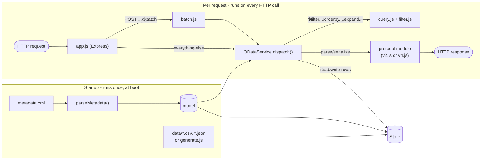

# Architecture



One model, parsed once at startup, backs a V2 service and a V4 service sharing the same in-memory `Store`. Each protocol module only knows how its own wire format looks (literals, JSON envelope, query option names); `service.js` does the actual URL/key parsing, navigation, and CRUD, protocol-agnostically.

## Using it in code

The package exports the Express app, so you can start it from a test or mount it in your own server:

```js
const { createApp } = require("odata-prova");

const { app } = createApp({
  modelDir: "./MySrv",
  v2Path: "/odata/v2/MySrv", // a falsy path disables that protocol
  v4Path: "/odata/v4/MySrv",
  mockRows: 20, // default 0: only the data files
});
app.listen(3000);
```

## Possible future improvements

- **Draft validation** - drafts are activated as they are: no validation messages, side effects, or locks between users.
- **Optimistic concurrency** - no ETags and no `If-Match` checks, so concurrent updates are last-write-wins.
- **Richer operation rules** - rules can only set fixed values; conditions, computed values or creating entities would need more.
- **Broader query option support** - `$apply`, `$compute`, and server-driven paging via `$skiptoken`/`$deltatoken` are currently rejected with 501.
- **Persistent storage** - swap the in-memory `Store` for a real database.

## References

Specs and docs used for implementing the metadata parser, $filter, $expand, and $batch:

- [OData Version 2.0](https://www.odata.org/documentation/odata-version-2-0/) - odata.org docs (metadata, URI conventions, JSON format)
- [OData Version 4.01, Part 1: Protocol](https://docs.oasis-open.org/odata/odata/v4.01/odata-v4.01-part1-protocol.html) - OASIS standard
- [OData CSDL XML Representation, Version 4.01](https://docs.oasis-open.org/odata/odata-csdl-xml/v4.01/os/odata-csdl-xml-v4.01-os.html) - the $metadata XML format for V4
- [SAP Annotations for OData Version 2.0](https://sap.github.io/odata-vocabularies/docs/v2-annotations.html) - `sap:` namespace attributes (label, display-format, content-version, etc.)
